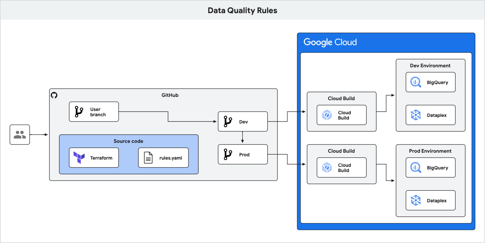

# terraform-google-dataplex-auto-data-quality

This modules shows how to deploy [data quality](https://cloud.google.com/dataplex/docs/auto-data-quality-overview) rules on [BigQuery](https://cloud.google.com/bigquery) tables across development and production environments using [Cloud Build](https://cloud.google.com/build).

## preDeploy
To deploy this blueprint you must have an active billing account and billing permissions.

## Architecture

1. Pushes data quality rules as YAML to a personal branch
2. PR from personal branch to upstream `dev` triggers Cloud Build to deploy Terraform
3. PR from upstream `dev` to upstream `prod` triggers Cloud Build to deploy Terraform

## Documentation
- [Manage data quality rules as code](https://cloud.google.com/dataplex/docs/manage-data-quality-rules-as-code)

## Deployment Duration
Configuration: 5 mins
Deployment: 5 mins

## Cost
[Blueprint cost details](https://cloud.google.com/products/calculator-legacy/#id=0c72736c-163f-4a7a-87e2-9df8bb7fde61)

## Usage

Basic usage of this module is as follows:

```hcl
module "dataplex_auto_data_quality" {
  source = "modules/deploy"

  project_id             = var.project_id
  data_quality_spec_file = "rules/orders.dev.yaml"
  environment            = "dev"
}
```

Functional examples are included in the
[examples](./examples/) directory.

<!-- BEGINNING OF PRE-COMMIT-TERRAFORM DOCS HOOK -->
## Inputs

| Name | Description | Type | Default | Required |
|------|-------------|------|---------|:--------:|
| project\_id | The project ID to deploy to | `string` | n/a | yes |

## Outputs

| Name | Description |
|------|-------------|
| bigquery\_dataset | The BigQuery dataset to use |
| bigquery\_table | The BigQuery table to use |

<!-- END OF PRE-COMMIT-TERRAFORM DOCS HOOK -->

## Requirements

These sections describe requirements for using this module.

### Software

The following dependencies must be available:

- [Terraform][terraform] v0.13
- [Terraform Provider for GCP][terraform-provider-gcp] plugin ~> v4.83

### Service Account

A service account with the following roles must be used to provision
the resources of this module:

- BigQuery Admin: `roles/bigquery.admin`
- Cloud Build Admin: `roles/cloudbuild.builds.editor`
- Dataplex Admin: `roles/dataplex.admin`
- Storage Admin: `roles/storage.admin`

The [Project Factory module][project-factory-module] and the
[IAM module][iam-module] may be used in combination to provision a
service account with the necessary roles applied.

### APIs

A project with the following APIs enabled must be used to host the
resources of this module:

- Google Cloud Storage JSON API: `storage-api.googleapis.com`
- Google Cloud Resource Manager API: `cloudresourcemanager.googleapis.com`
- Google Cloud Service Usage API: `serviceusage.googleapis.com`

The [Project Factory module][project-factory-module] can be used to
provision a project with the necessary APIs enabled.

## Contributing

Refer to the [contribution guidelines](./CONTRIBUTING.md) for
information on contributing to this module.

[iam-module]: https://registry.terraform.io/modules/terraform-google-modules/iam/google
[project-factory-module]: https://registry.terraform.io/modules/terraform-google-modules/project-factory/google
[terraform-provider-gcp]: https://www.terraform.io/docs/providers/google/index.html
[terraform]: https://www.terraform.io/downloads.html

## Security Disclosures

Please see our [security disclosure process](./SECURITY.md).
